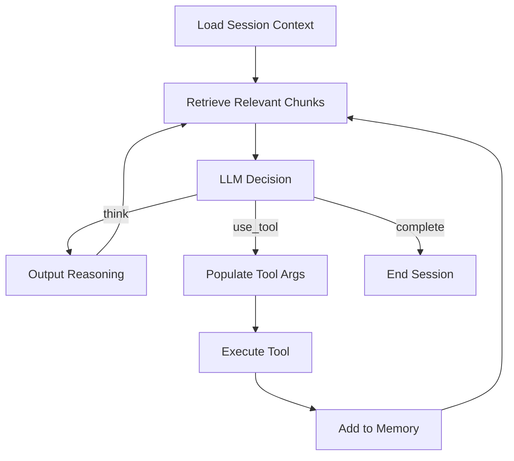
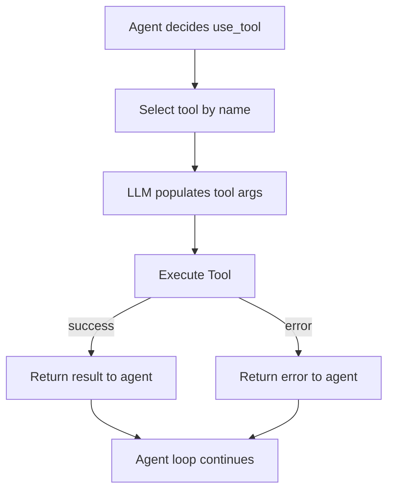
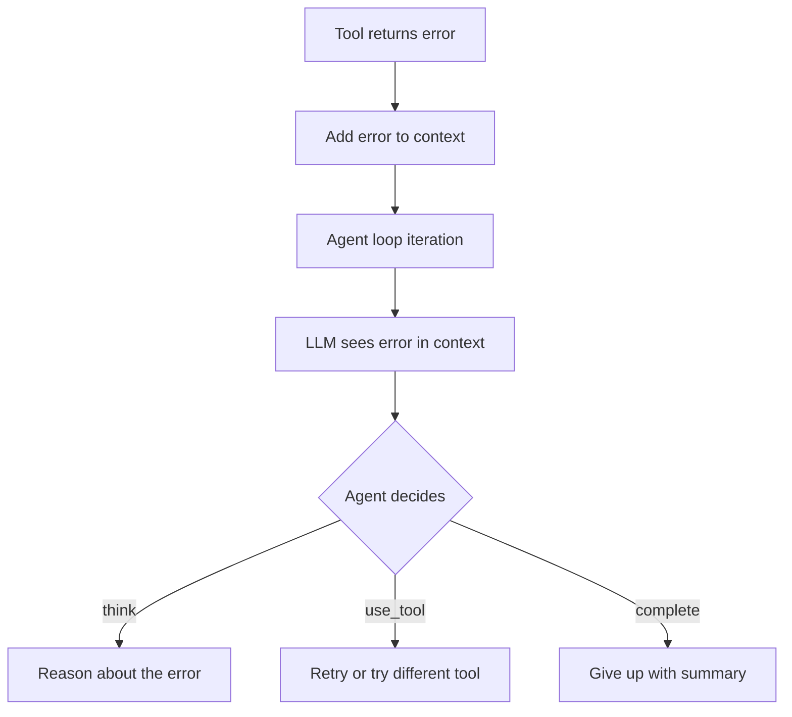
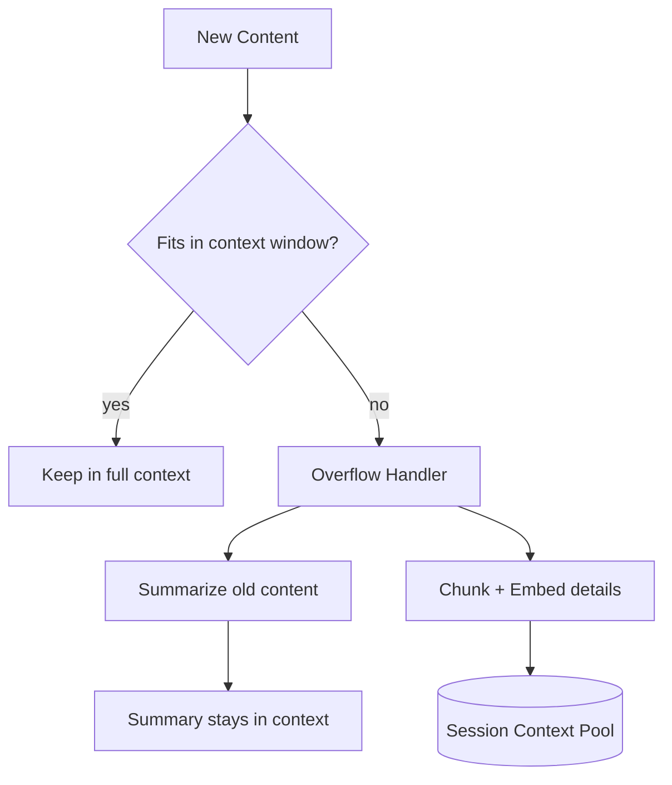
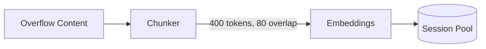
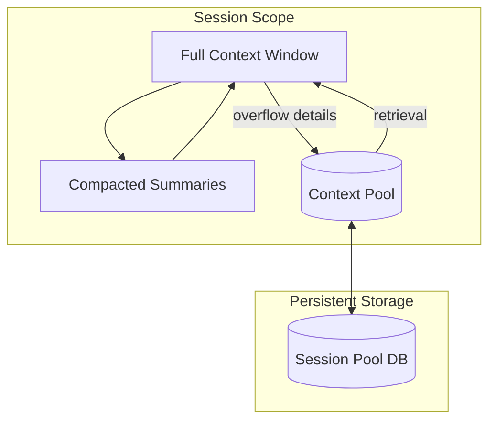

# Agent Architecture

## Overview

Refactor `Agent` to use a **hybrid inline reasoning loop** with optional planning. The agent reasons and acts fluidly by default, but can emit structured plans when tasks are complex. Hybrid context strategy uses full context window when possible, with summarization compaction and retrieval fallback for overflow.

## Architecture

The agent operates in a single continuous loop, making decisions at each iteration:



### Decision Types

At each iteration, the agent chooses one of:

- **think**: Reason out loud without taking action. Used for analysis, verification, and working through problems.
- **use_tool**: Select a tool to execute. A follow-up LLM call populates the tool's arguments.
- **complete**: Task is done. End the session.

### Inline Verification

Verification happens as part of normal reasoning. After completing actions, the agent uses `think` to assess:

- Did the action succeed?
- Does the result match expectations?
- Is the overall goal achieved?

If verification fails, the agent continues reasoning toward a fix.

## Tool Calls

Tool calls are a two-step process: the agent first selects which tool to use, then a second LLM call populates the tool's arguments.



**Key principles:**

1. **No nested tool calls** - A tool call cannot trigger other tool calls. It executes and returns.
2. **Errors bubble up** - All errors are returned to the agent loop, which then uses `think` to decide how to proceed.
3. **Agent decides next step** - Whether to retry, try a different tool, gather more context, or give up is decided by the agent through its normal reasoning.

Tools are classified by type:

- **GATHER**: Context gathering (search, read, query, prompt user)
- **ACTION**: Operations that change state (write, delete, send)

### Error Handling

When a tool call fails, the error is added to context and the agent continues its loop:



The agent can see error history and decide:

- Retry with different arguments
- Use a different tool
- Gather more context first
- Give up if errors are unrecoverable

## Memory

The agent uses a **hybrid context strategy** within each session, combining summarization compaction with retrieval fallback. Sessions are isolated - they do not share memory with each other.

### Context Strategy



**Full context first**: Content stays in the context window as long as it fits. The agent sees everything without overhead, enabling better cross-document reasoning.

**Overflow handling**: When the context window fills, older content is processed in two ways:

1. **Summarized** - A concise summary is generated and kept in the context window, providing continuous awareness
2. **Chunked** - Full details are chunked, embedded, and stored in the session pool for retrieval

**Retrieval when needed**: If the summary isn't enough, the agent can retrieve detailed chunks from the pool.

### Compaction (Summarization)

When content overflows, the agent generates a summary of the older content. The summary captures:

- Key information and findings
- Important decisions and outcomes
- References to what was processed

The summary stays in the context window, ensuring the agent always has high-level awareness of everything that happened, even as details move to the pool.

### Context Pool (Detail Storage)

The context pool stores the full details of summarized content. It serves as a safety net - when the summary isn't sufficient, the agent can retrieve specific chunks.



### Retrieval

When retrieval is needed, the context pool uses **hybrid retrieval**:

- **Vector Search (0.7 weight)**: Semantic similarity using embeddings. Finds conceptually related content even when wording differs.

- **BM25 (0.3 weight)**: Lexical matching based on term frequency. Excels at exact keyword matches, technical terms, and code symbols.

### Session Isolation

Each session has its own context pool. Sessions do not access each other's memory. A new session starts fresh. Persistence allows a session to be resumed if interrupted.



## Implementation

### 1. Enums & Tool Updates

Tools are classified into two types that determine their purpose within the agent loop. GATHER tools fetch information without side effects, while ACTION tools perform operations that change external state.

The `ToolType` enum lives in `py_ai_toolkit/core/enums.py`:

```python
from enum import Enum

class ToolType(str, Enum):
    GATHER = "gather"
    ACTION = "action"

class AgentStatus(str, Enum):
    RUNNING = "running"
    COMPLETE = "complete"
    ERROR = "error"
```

The `Tool` class and `tool()` decorator are updated to accept a `tool_type` parameter. This classification helps the agent reason about what kind of operation it's performing:

```python
@tool(tool_type=ToolType.GATHER)
def read_file(path: str) -> str:
    """Read contents of a file."""
    return Path(path).read_text()

@tool(tool_type=ToolType.ACTION)
def write_file(path: str, content: str) -> bool:
    """Write content to a file."""
    Path(path).write_text(content)
    return True
```

### 2. Agent State & Decision Models

The agent uses Pydantic models for both internal state and LLM-structured outputs. Decision models are passed as `response_model` to the LLM, enabling type-safe decision parsing.

#### AgentState

Tracks the agent's current state throughout a session:

```python
class AgentState(BaseModel):
    session_id: str
    goal: str
    context_window: list[str] = []
    status: AgentStatus = AgentStatus.RUNNING
    has_overflow: bool = False
```

#### Decision Models

The LLM returns one of these decision types at each iteration. They form a discriminated union:

```python
class ThinkDecision(BaseModel):
    reasoning: str

class UseToolDecision(BaseModel):
    tool_name: str

class CompleteDecision(BaseModel):
    summary: str

AgentDecision = ThinkDecision | UseToolDecision | CompleteDecision
```

`UseToolDecision` only contains the tool name. Once the agent selects a tool, a follow-up LLM call populates the arguments using the tool's dynamically-generated parameter model:

```python
# Agent selects tool
decision = await llm(response_model=AgentDecision, ...)

if isinstance(decision, UseToolDecision):
    tool = tools[decision.tool_name]
    # Second call to populate args using tool's parameter model
    args = await llm(response_model=tool.parameters, ...)
    result = await tool.execute(**args.model_dump())
```

#### Tool Call Outcome

Captures the result of a tool execution, whether success or error:

```python
class ToolCallOutcome(BaseModel):
    tool_name: str
    tool_args: dict
    success: bool
    result: Any | None = None
    error: str | None = None
```

### 3. Agent Core

The agent is a simple async loop that retrieves context, prompts the LLM for a decision, and executes it. No framework required - just a `while` loop with pattern matching.

#### Agent Class

```python
class Agent:
    def __init__(self, toolkit: Toolkit, tools: list[Tool]):
        self.toolkit = toolkit
        self.tools = {t.name: t for t in tools}
        self.state: AgentState | None = None
    
    async def run(self, goal: str) -> AgentState:
        self.state = AgentState(
            session_id=uuid4().hex,
            goal=goal,
        )
        
        while self.state.status == AgentStatus.RUNNING:
            await self._loop_iteration()
        
        return self.state
```

#### Main Loop

Each iteration: check for overflow, retrieve context if needed, get LLM decision, execute it.

```python
async def _loop_iteration(self):
    if self._needs_compaction():
        await self._compact_context()
    
    retrieved = []
    if self.state.has_overflow:
        retrieved = await self._retrieve_chunks()
    
    decision = await self._get_decision(retrieved)
    await self._execute_decision(decision)
```

#### Decision Execution

Pattern match on the decision type and execute accordingly:

```python
async def _execute_decision(self, decision: AgentDecision):
    match decision:
        case ThinkDecision(reasoning=reasoning):
            self.state.context_window.append(f"[Think] {reasoning}")
        
        case UseToolDecision(tool_name=tool_name):
            outcome = await self._execute_tool(tool_name)
            self.state.context_window.append(
                f"[Tool: {tool_name}] {outcome.result or outcome.error}"
            )
        
        case CompleteDecision(summary=summary):
            self.state.context_window.append(f"[Complete] {summary}")
            self.state.status = AgentStatus.COMPLETE
```

#### Two-Step Tool Execution

First select the tool, then populate its arguments with a second LLM call:

```python
async def _execute_tool(self, tool_name: str) -> ToolCallOutcome:
    tool = self.tools[tool_name]
    
    try:
        args = await self.toolkit.asend(
            response_model=tool.parameters,
            template="Fill the arguments for the {{ tool_name }} tool.",
            tool_name=tool_name,
            tool_description=tool.description,
            context=self.state.context_window,
        )
        
        result = await tool.execute(**args.model_dump())
        
        return ToolCallOutcome(
            tool_name=tool_name,
            tool_args=args.model_dump(),
            success=True,
            result=result,
        )
    except Exception as e:
        return ToolCallOutcome(
            tool_name=tool_name,
            tool_args={},
            success=False,
            error=str(e),
        )
```

#### Getting a Decision

Prompt the LLM with current context and available tools:

```python
async def _get_decision(self, retrieved: list[str]) -> AgentDecision:
    tool_descriptions = [
        f"- {name}: {t.description} ({t.tool_type.value})"
        for name, t in self.tools.items()
    ]
    
    return await self.toolkit.asend(
        response_model=AgentDecision,
        template="agent_decision.jinja2",
        goal=self.state.goal,
        context=self.state.context_window,
        retrieved=retrieved,
        tools=tool_descriptions,
    )
```

### 4. Memory - Compaction

When the context window exceeds a token threshold, older content is compacted: summarized for awareness and chunked for retrieval. This keeps the context window bounded while preserving access to details.

#### Compaction Model

```python
class CompactionSummary(BaseModel):
    summary: str
    key_findings: list[str]
    references: list[str]  # What was processed (file names, tool calls, etc.)
```

#### Detecting Overflow

Check if context exceeds the token budget. Uses a simple token estimation (4 chars ≈ 1 token):

```python
def _needs_compaction(self) -> bool:
    total_chars = sum(len(item) for item in self.state.context_window)
    estimated_tokens = total_chars // 4
    return estimated_tokens > self.max_context_tokens

# In __init__:
self.max_context_tokens = 80_000  # Leave room for response
self.compaction_threshold = 0.6   # Compact oldest 60% of content
```

#### Compaction Process

When overflow is detected, the oldest portion of context is summarized and chunked:

```python
async def _compact_context(self):
    split_idx = int(len(self.state.context_window) * self.compaction_threshold)
    to_compact = self.state.context_window[:split_idx]
    to_keep = self.state.context_window[split_idx:]
    
    # 1. Generate summary
    summary = await self._summarize_content(to_compact)
    
    # 2. Chunk and store details
    await self._store_chunks(to_compact)
    
    # 3. Replace old content with summary
    self.state.context_window = [
        f"[Compacted Summary]\n{summary.summary}\n\nKey findings: {summary.key_findings}"
    ] + to_keep
    
    self.state.has_overflow = True
```

#### Summarization

Generate a concise summary of the content being compacted:

```python
async def _summarize_content(self, content: list[str]) -> CompactionSummary:
    return await self.toolkit.asend(
        response_model=CompactionSummary,
        template="""
        Summarize the following context that is being archived.
        Preserve key information, decisions, and outcomes.
        Note what files/tools/resources were involved.
        
        Content:
        
        {{ item }}
        ---
        
        """,
        content=content,
    )
```

#### Chunking and Storage

Split compacted content into overlapping chunks using Chonkie and store in the session pool:

```python
from chonkie import TokenChunker

# In Agent.__init__
self.chunker = TokenChunker(
    chunk_size=400,
    chunk_overlap=80,
)

async def _store_chunks(self, content: list[str]):
    full_text = "\n\n".join(content)
    chunks = self.chunker.chunk(full_text)
    
    for chunk in chunks:
        embedding = await self._embed(chunk.text)
        await self.pool.store(
            text=chunk.text,
            embedding=embedding,
            session_id=self.state.session_id,
        )
```

### 5. Memory - Context Pool

The context pool is a SQLite-backed vector store scoped to the current session. It stores chunks with embeddings for hybrid retrieval (vector + BM25).

#### Chunk Model

```python
class StoredChunk(BaseModel):
    id: str
    session_id: str
    text: str
    embedding: list[float]
    created_at: datetime
    access_count: int = 0
```

#### Context Pool Class

```python
class ContextPool:
    def __init__(self, db_path: str, embedding_dim: int = 1536):
        self.db_path = db_path
        self.embedding_dim = embedding_dim
        self._init_db()
    
    def _init_db(self):
        conn = sqlite3.connect(self.db_path)
        conn.execute("""
            CREATE TABLE IF NOT EXISTS chunks (
                id TEXT PRIMARY KEY,
                session_id TEXT NOT NULL,
                text TEXT NOT NULL,
                embedding BLOB NOT NULL,
                created_at TIMESTAMP DEFAULT CURRENT_TIMESTAMP,
                access_count INTEGER DEFAULT 0
            )
        """)
        conn.execute("CREATE INDEX IF NOT EXISTS idx_session ON chunks(session_id)")
        conn.commit()
        conn.close()
```

#### Storing Chunks

```python
async def store(self, text: str, embedding: list[float], session_id: str):
    chunk_id = uuid4().hex
    embedding_blob = self._serialize_embedding(embedding)
    
    conn = sqlite3.connect(self.db_path)
    conn.execute(
        "INSERT INTO chunks (id, session_id, text, embedding) VALUES (?, ?, ?, ?)",
        (chunk_id, session_id, text, embedding_blob),
    )
    conn.commit()
    conn.close()

def _serialize_embedding(self, embedding: list[float]) -> bytes:
    import struct
    return struct.pack(f"{len(embedding)}f", *embedding)

def _deserialize_embedding(self, blob: bytes) -> list[float]:
    import struct
    count = len(blob) // 4
    return list(struct.unpack(f"{count}f", blob))
```

#### Embedding Generation

Uses the toolkit's embedding model (or a dedicated embedding service):

```python
# In Agent class
async def _embed(self, text: str) -> list[float]:
    response = await self.toolkit.embed(text)
    return response.embedding
```

#### Agent Integration

The pool is initialized per session:

```python
# In Agent.__init__
self.pool = ContextPool(
    db_path=f".agent_sessions/{session_id}.db",
    embedding_dim=1536,
)
```

### 6. Memory - Retrieval

When the agent has overflow content, it retrieves relevant chunks using hybrid search: vector similarity (semantic) combined with BM25 (lexical). This ensures both conceptual matches and exact keyword hits.

#### Retrieval Method

Called from the main loop when `has_overflow` is true:

```python
async def _retrieve_chunks(self, top_k: int = 5) -> list[str]:
    query = self._build_retrieval_query()
    query_embedding = await self._embed(query)
    
    results = await self.pool.hybrid_search(
        query_text=query,
        query_embedding=query_embedding,
        session_id=self.state.session_id,
        top_k=top_k,
    )
    
    return [r.text for r in results]

def _build_retrieval_query(self) -> str:
    """Build query from recent context and goal."""
    recent = self.state.context_window[-3:] if self.state.context_window else []
    return f"Goal: {self.state.goal}\n\nRecent context:\n" + "\n".join(recent)
```

#### Hybrid Search

Combines vector similarity (0.7 weight) with BM25 lexical search (0.3 weight):

```python
# In ContextPool class
async def hybrid_search(
    self,
    query_text: str,
    query_embedding: list[float],
    session_id: str,
    top_k: int = 5,
    vector_weight: float = 0.7,
    bm25_weight: float = 0.3,
) -> list[StoredChunk]:
    chunks = self._get_session_chunks(session_id)
    
    # Vector similarity scores
    vector_scores = self._vector_search(query_embedding, chunks)
    
    # BM25 lexical scores
    bm25_scores = self._bm25_search(query_text, chunks)
    
    # Combine scores
    combined = {}
    for chunk_id, score in vector_scores.items():
        combined[chunk_id] = score * vector_weight
    for chunk_id, score in bm25_scores.items():
        combined[chunk_id] = combined.get(chunk_id, 0) + score * bm25_weight
    
    # Sort and return top_k
    sorted_ids = sorted(combined, key=combined.get, reverse=True)[:top_k]
    return [self._get_chunk_by_id(chunk_id) for chunk_id in sorted_ids]
```

#### Vector Similarity

Cosine similarity between query embedding and stored chunk embeddings:

```python
def _vector_search(
    self,
    query_embedding: list[float],
    chunks: list[StoredChunk],
) -> dict[str, float]:
    scores = {}
    for chunk in chunks:
        score = self._cosine_similarity(query_embedding, chunk.embedding)
        scores[chunk.id] = score
    return self._normalize_scores(scores)

def _cosine_similarity(self, a: list[float], b: list[float]) -> float:
    dot = sum(x * y for x, y in zip(a, b))
    norm_a = sum(x * x for x in a) ** 0.5
    norm_b = sum(x * x for x in b) ** 0.5
    return dot / (norm_a * norm_b) if norm_a and norm_b else 0.0
```

#### BM25 Lexical Search

Term frequency-based scoring for exact keyword matches:

```python
def _bm25_search(
    self,
    query_text: str,
    chunks: list[StoredChunk],
    k1: float = 1.5,
    b: float = 0.75,
) -> dict[str, float]:
    query_terms = query_text.lower().split()
    avg_len = sum(len(c.text.split()) for c in chunks) / len(chunks) if chunks else 1
    
    scores = {}
    for chunk in chunks:
        chunk_terms = chunk.text.lower().split()
        chunk_len = len(chunk_terms)
        score = 0.0
        
        for term in query_terms:
            tf = chunk_terms.count(term)
            df = sum(1 for c in chunks if term in c.text.lower())
            idf = math.log((len(chunks) - df + 0.5) / (df + 0.5) + 1)
            
            numerator = tf * (k1 + 1)
            denominator = tf + k1 * (1 - b + b * chunk_len / avg_len)
            score += idf * numerator / denominator
        
        scores[chunk.id] = score
    
    return self._normalize_scores(scores)

def _normalize_scores(self, scores: dict[str, float]) -> dict[str, float]:
    if not scores:
        return scores
    max_score = max(scores.values())
    if max_score == 0:
        return scores
    return {k: v / max_score for k, v in scores.items()}
```

### 7. Session Management

Sessions can be persisted to disk and resumed later. The `AgentState` is serialized to JSON alongside the SQLite context pool.

#### Session Directory Structure

```
.agent_sessions/
├── {session_id}/
│   ├── state.json      # AgentState serialized
│   └── pool.db         # SQLite context pool
```

#### Saving Session

Called automatically at the end of `run()` or on interrupt:

```python
def _save_session(self):
    session_dir = Path(f".agent_sessions/{self.state.session_id}")
    session_dir.mkdir(parents=True, exist_ok=True)
    
    state_path = session_dir / "state.json"
    state_path.write_text(self.state.model_dump_json(indent=2))

# In Agent.run()
async def run(self, goal: str) -> AgentState:
    self.state = AgentState(session_id=uuid4().hex, goal=goal)
    self._init_pool()
    
    try:
        while self.state.status == AgentStatus.RUNNING:
            await self._loop_iteration()
    finally:
        self._save_session()
    
    return self.state
```

#### Resuming Session

Class method to resume from a saved session:

```python
@classmethod
async def resume(cls, session_id: str, toolkit: Toolkit, tools: list[Tool]) -> "Agent":
    session_dir = Path(f".agent_sessions/{session_id}")
    
    if not session_dir.exists():
        raise ValueError(f"Session {session_id} not found")
    
    state_path = session_dir / "state.json"
    state = AgentState.model_validate_json(state_path.read_text())
    
    agent = cls(toolkit=toolkit, tools=tools)
    agent.state = state
    agent._init_pool()
    
    return agent

def _init_pool(self):
    session_dir = Path(f".agent_sessions/{self.state.session_id}")
    session_dir.mkdir(parents=True, exist_ok=True)
    
    self.pool = ContextPool(
        db_path=str(session_dir / "pool.db"),
        embedding_dim=1536,
    )
```

#### Listing Sessions

Utility to list available sessions:

```python
@staticmethod
def list_sessions() -> list[dict]:
    sessions_dir = Path(".agent_sessions")
    if not sessions_dir.exists():
        return []
    
    sessions = []
    for session_dir in sessions_dir.iterdir():
        if session_dir.is_dir():
            state_path = session_dir / "state.json"
            if state_path.exists():
                state = AgentState.model_validate_json(state_path.read_text())
                sessions.append({
                    "session_id": state.session_id,
                    "goal": state.goal,
                    "status": state.status.value,
                })
    return sessions
```

### 8. Exports & Tests

#### Package Exports

Update `py_ai_toolkit/__init__.py` to export agent components:

```python
from py_ai_toolkit.core.agent import Agent, AgentState
from py_ai_toolkit.core.enums import ToolType, AgentStatus
from py_ai_toolkit.core.tool import Tool, tool

__all__ = [
    # Agent
    "Agent",
    "AgentState",
    # Enums
    "ToolType",
    "AgentStatus",
    # Tools
    "Tool",
    "tool",
    # ... existing exports
]
```

#### Unit Tests

Test file structure in `tests/unit/test_agent.py`:

```python
import pytest
from py_ai_toolkit import Agent, AgentState, ToolType, AgentStatus, tool

class TestAgentState:
    def test_default_status_is_running(self):
        state = AgentState(session_id="test", goal="test goal")
        assert state.status == AgentStatus.RUNNING
    
    def test_context_window_starts_empty(self):
        state = AgentState(session_id="test", goal="test goal")
        assert state.context_window == []

class TestAgent:
    @pytest.fixture
    def sample_tools(self):
        @tool(tool_type=ToolType.GATHER)
        def read_file(path: str) -> str:
            return "file content"
        
        @tool(tool_type=ToolType.ACTION)
        def write_file(path: str, content: str) -> bool:
            return True
        
        return [read_file, write_file]
    
    def test_init_creates_tool_dict(self, sample_tools, mock_toolkit):
        agent = Agent(toolkit=mock_toolkit, tools=sample_tools)
        assert "read_file" in agent.tools
        assert "write_file" in agent.tools
    
    def test_tool_type_classification(self, sample_tools, mock_toolkit):
        agent = Agent(toolkit=mock_toolkit, tools=sample_tools)
        assert agent.tools["read_file"].tool_type == ToolType.GATHER
        assert agent.tools["write_file"].tool_type == ToolType.ACTION

class TestDecisionExecution:
    async def test_think_adds_to_context(self, agent):
        decision = ThinkDecision(reasoning="I should check the file")
        await agent._execute_decision(decision)
        assert "[Think]" in agent.state.context_window[-1]
    
    async def test_complete_sets_status(self, agent):
        decision = CompleteDecision(summary="Task done")
        await agent._execute_decision(decision)
        assert agent.state.status == AgentStatus.COMPLETE

class TestSessionManagement:
    def test_save_creates_session_dir(self, agent, tmp_path):
        agent._save_session()
        assert (tmp_path / f".agent_sessions/{agent.state.session_id}").exists()
    
    async def test_resume_loads_state(self, agent, tmp_path):
        agent._save_session()
        resumed = await Agent.resume(
            session_id=agent.state.session_id,
            toolkit=agent.toolkit,
            tools=list(agent.tools.values()),
        )
        assert resumed.state.goal == agent.state.goal
```

## Implementation Checklist

- [ ] 1. Enums: Create `ToolType` and `AgentStatus` enums
- [ ] 2. Tool Updates: Add `tool_type` parameter to `Tool` and `tool()`
- [ ] 3. State & Models: `AgentState`, decision models, `ToolCallOutcome`
- [ ] 4. Agent Core: `Agent` class, main loop, decision execution
- [ ] 5. Compaction: Overflow detection, summarization, chunking
- [ ] 6. Context Pool: SQLite storage, embeddings, `StoredChunk`
- [ ] 7. Retrieval: Hybrid search (vector + BM25)
- [ ] 8. Session Management: Save/resume sessions
- [ ] 9. Exports & Tests: Package exports, unit tests
